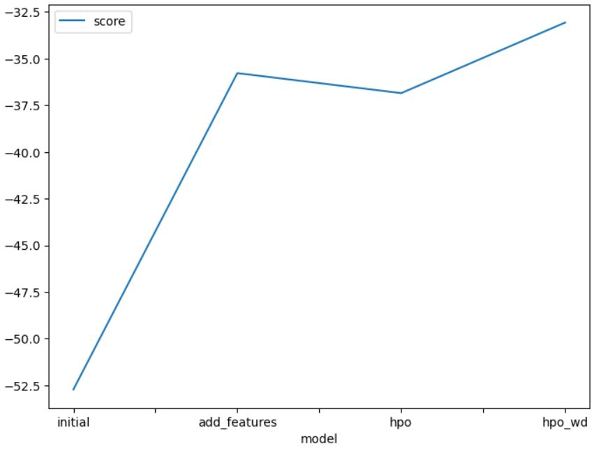

# Report: Predict Bike Sharing Demand with AutoGluon Solution
#### Rafal Kowalski

## Initial Training
### What did you realize when you tried to submit your predictions? What changes were needed to the output of the predictor to submit your results?
When I used the raw dataset without perfoming any data analysis or feature engineering, there was no need to update the prediction values because they were all positive. Unfortunately, the model performed Poverty poor !!!.

### What was the top ranked model that performed?
The top score model was "WeightedEnsemble_L3". During training phase it reseived `score_val= -52.722403` but Kaggle submission gave it `score=1.80912`, which was a very poor result compared to other competitors.

## Exploratory data analysis and feature creation
### What did the exploratory analysis find and how did you add additional features?
TODO: Add your explanation

### How much better did your model preform after adding additional features and why do you think that is?
TODO: Add your explanation

## Hyper parameter tuning
### How much better did your model preform after trying different hyper parameters?
TODO: Add your explanation

### If you were given more time with this dataset, where do you think you would spend more time?
TODO: Add your explanation

### Create a table with the models you ran, the hyperparameters modified, and the kaggle score.
|    | model        | hpo1              | hpo2                   | hpo3                                      |   score |
|---:|:-------------|:------------------|:-----------------------|:------------------------------------------|--------:|
|  0 | initial      | time_limit=600    | presets="best_quality" | default_vals;                             | 1.80912 |
|    |              |                   |                        | WeightedEnsemble_L3  -52.722403           |         |
|  1 | add_features | time_limit=600    | presets="best_quality" | default_vals;                             | 0.46416 |
|    |              |                   |                        | WeightedEnsemble_L3  -35.780141           |         |
|  2 | hpo          | time_limit=12*600 | presets="best_quality" | tabular autogluon: ['CAT', 'GBM', 'XGB']; | 0.54626 |
|    |              |                   |                        | WeightedEnsemble_L2: -36.734638           |         |

### Create a line plot showing the top model score for the three (or more) training runs during the project.

TODO: Replace the image below with your own.

### Create a line plot showing the top kaggle score for the three (or more) prediction submissions during the project.

TODO: Replace the image below with your own.

## Summary
TODO: Add your explanation
