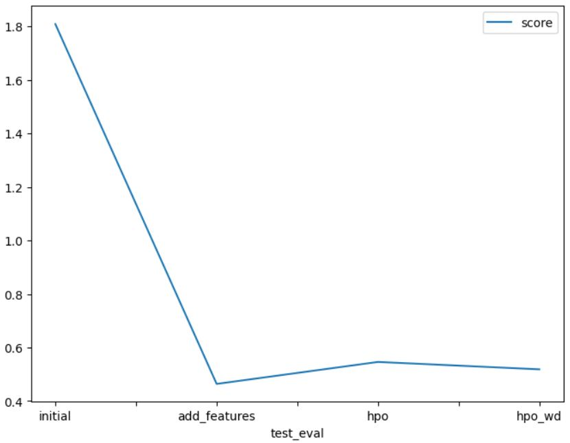

# Report: Predict Bike Sharing Demand with AutoGluon Solution
#### Rafal Kowalski

## Initial Training
### What did you realize when you tried to submit your predictions? What changes were needed to the output of the predictor to submit your results?
When I used the raw dataset without perfoming any data analysis or feature engineering, there was no need to update the prediction values because they were all positive. Unfortunately, the model performed Poverty poor !!!.

### What was the top ranked model that performed?
The top score model was "WeightedEnsemble_L3". During training phase it reseived `score_val= -52.722403` but Kaggle submission gave it `score=1.80912`, which was a very poor result compared to other competitors.

## Exploratory data analysis and feature creation
### What did the exploratory analysis find and how did you add additional features?
1. Create new features:
> . Feature `datetime` was parsed as a datetime feature to obtain hour information from timestamp.  
> . New features: `year`, `month`, `day` and `hour` were extracted from the `datetime` feature using feature extraction.  
> . Upon feature extraction, `datetime` was excluded from the TabularPredictor using _learner_kwargs={"ignored_columns":ignored_columns}_  parameter
  
2. Change feature type to categorical:
> . The parameters: `season`, `weather`, `workingday` and `holiday` store numeric values, but due to the lack of sequential dependence of their values, they are all defined as categorical.
  
  
3. Conclusions from the analysis of the correlation of features with the target:
> . Features: `temp`, `atemp`,`hour` and `year` showed a high positive correlation with target `count`.
> . Features: `month`, `season` and `windspeed` showed moderate positiv correlation with target `count`.
> . Features: `weather` and `humidity` showed moderate negativ correlation with target `count`.
> . Feature `year` showed high positiv correlation with target (0.26). But this connection looks naive, because there are only two values of this feature in the data, and the popularity of the offer has simply increased.
> . Feature `day` seems to be useless  
  
4. Creation of a third `hpo` prediction model and commissioning its evaluation by Kaggle:
> . The kaggle score of the new model is definitely worse than the previous simpler model.  
> . Most likely, the effect of overfitting the model was obtained.
   
5. Create one more new feature:
> . After making the previous model, I realized that the number of the day of the week can have a beneficial effect on the prediction of customer behavior
> . New feature: `weekday` was extracted from the `datetime` feature using feature extraction.  
> . Upon feature extraction, `datetime` was excluded from the TabularPredictor using _learner_kwargs={"ignored_columns":ignored_columns}_  parameter   
   
4. Creation of a fourth `hpo_wd` prediction model and commissioning its evaluation by Kaggle:
> . The kaggle score of the fourth model is definitely better than the third model, but still worse than the results of the simpler model.  
> . Most likely, the effect of overfitting the model was obtained.

### How much better did your model preform after adding additional features and why do you think that is?
. After creating additional features, Kaggle's scoring has been significantly improved.  
. The prediction model received a set of additional parameters that it could use in a more effective way.  
. It was predictable that the `datetime` feature in its original packaged form would be of little use.  
. In addition, the situation improved after replacing the feature group with numeric but classifying features with `categorical`.

## Hyper parameter tuning
### How much better did your model preform after trying different hyper parameters?
. The kaggle score of the models after adding additional features was slightly worse.  
. Most likely, the effect of overfitting the model was obtained.

### If you were given more time with this dataset, where do you think you would spend more time?
. I think that a thorough analysis of the dependencies of all features with each other and with the target `count` will help to get a better result.  
. It is likely that changing the distribution of features or creating new derived features will improve the results

### Create a table with the models you ran, the hyperparameters modified, and the kaggle score.
|    | model        | hpo1              | hpo2                                                        | hpo3                                   |   score |
|---:|:-------------|:------------------|:------------------------------------------------------------|:---------------------------------------|--------:|
|  0 | initial      | default_vals      | default_vals                                                | default_vals;                          | 1.80912 |
|    |              |                   |                                                             | WeightedEnsemble_L3  -52.722403        |         |
|  1 | add_features | default_vals      | Categorical features:[season, weather, workingday, holiday] | default_vals;                          | 0.46416 |
|    |              |                   |                                                             | WeightedEnsemble_L3  -35.780141        |         |
|  2 | hpo          | time_limit=12*600 | Categorical:[season, weather, workingday, holiday]          | tabular autogluon: {'CAT','GBM','XGB'} | 0.54626 |
|    |              |                   |                                                             | WeightedEnsemble_L3: -36.850900        |         |
|  3 | hpo_wd       | time_limit=12*600 | Categorical:[+ weekday]                                     | tabular autogluon: {'CAT','GBM','XGB'} | 0.51866 |
|    |              |                   |                                                             | WeightedEnsemble_L2: -33.070803        |         |

### Create a line plot showing the top model score for the three (or more) training runs during the project.

### Create a line plot showing the top kaggle score for the three (or more) prediction submissions during the project.

## Summary
    . Thank you very much for preparing this exercise.  
    . There was very little time, but the situation forced me to work hard "after hours".  
    . The greatest benefit of working on the project was gaining practical skills in the operation of such EDA tools as "mxnet" and "autogluon".
